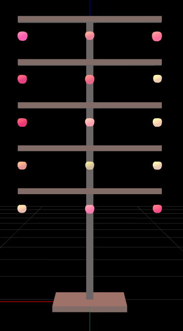

Repository for "*Populating Digital Orchards: Evaluation of a 3D Positioning Algorithm for Semi-Automated Data Collection and spawning*", *Simini et. al.*, IEEE MetroAgriFor 2024, Padova (IT).

**Abstract**
 
Precision Orchard Management tasks require high-grade precision representation of plants information to unleash the potential and the efficiency of involved operations. In order to improve this, especially when autonomous vehicles are involved, a 3D orchard reconstruction is particularly useful. This work aims to exploit RGBD images to estimate the local 3D position of fruits on a plant, with respect to the trunk position. Besides being a useful information to map plant production distribution, it can also be used to localize real objects in virtual environments, such as digital twins. The process can serve as a foundation of numerous monitoring activities, thinning procedures and autonomous harvesting tasks.
___

# Files Nomenclature

Files are named using the following structure:

Each component in the filename has a specific meaning:

- **`<#img>`**: Represents the file identifier. This is assigned to `color`, `depth` `annot` according to the file content.
- **`<trial>`**: Indicates the trial number. It represents the specific experiment or test case in which the image was used.
- **`<repetition>`**: Refers to the repetition number. This indicates how many times a specific trial has been repeated to account for variations and ensure accuracy.
- **`<background>`**: Specifies the background condition or setting used during the test. It helps distinguish tests conducted under different environments or configurations (values: `0` leafy, `1` black background).

**Example**:  
For a file named `color_1_1_0.png`, it can be interpreted as:

- `color`: RGB image
- `1`: Trial number 1
- `1`: First repetition  
- `0`: Leafy background

For a file named `depth_1_1_0.png`, it can be interpreted as:

- `depth`: Grayscale depth map
- `1`: Trial number 1 
- `1`: First repetition  
- `0`: Leafy background

For a file named `annot_1_1_0.json`, it can be interpreted as:

- `annot`: file including manual annotations made on the color image
- `1`: Trial number 1 
- `1`: First repetition  
- `0`: Leafy background

A more detailed description of files nomenclature can be found [here](docs/naming_protocoll.docx)

# Data Processing and Analysis
All the code used for data Processing and Analysis are available in the [notebooks](notebooks) directory divided for trial type and setup.

More information can be found in the conference proceedings paper (IN PRESS - Will be linked here once released) and in the presentation

# Results
## Laboratory test
Here below some graphical output obtained from the developed algorithm for the different trial 

### artificial tree (2D setup and leafy background)
| picture | reference twin | estimated twin |
|:---:|:---:|:---:|
| | | |

### artificial tree (2D setup and black background)
| picture | reference twin | estimated twin |
|:---:|:---:|:---:|
| | | |

### artificial tree (3D setup and leafy background)
| picture | reference twin | estimated twin |
|:---:|:---:|:---:|
| | | |

### artificial tree (3D setup and black background)
| picture | reference twin | estimated twin |
|:---:|:---:|:---:|
| | | |

<!-- ## Field test
Here below some graphical output obtained from the developed algorithm for the different trial 

### planar cordon (2D setup and leafy background)

### spindle-bush (3D setup and leafy background)

## Positioning performance evaluation
### Laboratory trial

A 2D architecture demonstrated in all lab and field conditions to reduce the positioning error.

Errors obtained using the artificial tree

Correlation heatmap showing no effect of object size on positioning.
 -->

### Field trial

Left- Mean Bias Error (MBE) per Axis; Right - Cumulative Error per Position

### planar cordon (2D setup and leafy background)

### spindle-bush (3D setup and leafy background)

## Positioning performance evaluation
### Laboratory trial

A 2D architecture demonstrated in all lab and field conditions to reduce the positioning error.

Errors obtained using the artificial tree.

Correlation heatmap showing no effect of object size on positioning.

___
[Get in contact with AUTHORS](./AUTHORS)
